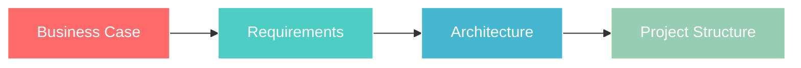
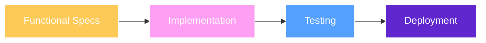

# Document Template Test

<div align="center">


**🤖 AI-Enhanced Software Development Life Cycle**

*Structured Human-AI Collaboration for Modern Software Development*

</div>

---

## 🌟 Project Overview

**Document Template Test** is developed using the cutting-edge **AI-SDLC methodology**, combining human expertise with AI capabilities to deliver exceptional software solutions through structured collaboration.

### 🎯 What Makes This Special

- **🧠 AI-Powered Analysis** - Intelligent requirements gathering and system design
- **👥 Human-AI Partnership** - Perfect balance of creativity and precision
- **📋 Structured Workflow** - Proven methodology for consistent results
- **🔄 Iterative Excellence** - Continuous improvement through each phase

---

## 🤖 Meet Your AI Team

<table>
<tr>
<td align="center">

<br><strong>Requirements & Analysis</strong>
<br><em>Collaborative discussions to gather and refine business requirements</em>
</td>
<td align="center">

<br><strong>System Architecture</strong>
<br><em>Technical design and architectural decision making</em>
</td>
<td align="center">

<br><strong>Project Coordination</strong>
<br><em>Workflow management and team coordination</em>
</td>
</tr>
</table>

---

## 🚀 AI-SDLC Workflow

### 📋 Phase 1: Strategic Planning & Design



| Step | AI Teammate | Deliverable | Human Role |
|------|-------------|-------------|------------|
| **1.1** | Sarah | Business Case | Strategic Input |
| **1.2** | Sarah | BRD & URD | Requirements Review |
| **1.3** | Alex | SRS & ADD | Technical Approval |
| **1.4** | Jordan | Project Structure | Workflow Approval |

### 🔧 Phase 2: Implementation & Delivery



---

## 📚 Documentation Architecture

```
📁 docs/
├── 📋 phase1-planning/
│   ├── 📄 business-case-template.md      # Problem & Solution Definition
│   ├── 📄 brd-template.md               # Business Requirements
│   ├── 📄 urd-template.md               # User Requirements  
│   ├── 📄 srs-template.md               # System Requirements
│   └── 📄 add-template.md               # Architecture Design
└── 🔧 phase2-implementation/
    ├── 📄 frs-template.md               # Functional Requirements
    └── 📄 implementation-plan-template.md # Development Roadmap
```

---

## 🎯 Getting Started

### 1. 📋 Check Your Project Board
Visit the **GitHub Project Board** to see current phase and assigned tasks

### 2. 🤖 Connect with AI Teammates  
Each task is assigned to a specific AI teammate for collaborative discussion

### 3. 💬 Start Collaborative Sessions
Engage in structured discussions to gather requirements and make decisions

### 4. 📝 Create Deliverables
Use professional templates to document decisions and specifications

### 5. ✅ Human Approval Gateway
Review and approve each phase before proceeding to implementation

---

## ✨ Key Features

<div align="center">

| Feature | Description |
|---------|-------------|
| 🎯 **Discussion-Driven** | Natural conversation leads to better requirements |
| 📋 **Template-Based** | Professional documentation with consistent structure |
| 🔗 **Full Traceability** | Every decision tracked from business case to code |
| 🔄 **Iterative Refinement** | Continuous improvement through feedback loops |
| 👥 **Human Oversight** | Critical decisions always require human approval |
| 🚀 **Proven Methodology** | Battle-tested approach for successful delivery |

</div>

---

## 🏆 Success Metrics

- **📈 Faster Requirements Gathering** - AI-assisted analysis reduces discovery time
- **🎯 Higher Quality Specifications** - Structured templates ensure completeness  
- **🔄 Better Stakeholder Alignment** - Clear documentation improves communication
- **⚡ Accelerated Development** - Well-defined requirements speed up implementation

---

<div align="center">

**🚀 Ready to Experience AI-Enhanced Development?**

*Check the Project Board • Connect with AI Teammates • Start Building*

---


</div>
